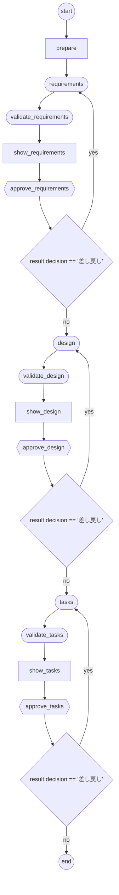

<!-- Generated by ugoke docs. Do not edit. -->

```mermaid
flowchart TD
  start_(("start"))
  s_prepare["prepare"]
  s_requirements(["requirements"])
  s_validate_requirements(["validate_requirements"])
  s_show_requirements["show_requirements"]
  s_approve_requirements{{"approve_requirements"}}
  d_approve_requirements_0{"result.decision == '差し戻し'"}
  s_design(["design"])
  s_validate_design(["validate_design"])
  s_show_design["show_design"]
  s_approve_design{{"approve_design"}}
  d_approve_design_0{"result.decision == '差し戻し'"}
  s_tasks(["tasks"])
  s_validate_tasks(["validate_tasks"])
  s_show_tasks["show_tasks"]
  s_approve_tasks{{"approve_tasks"}}
  d_approve_tasks_0{"result.decision == '差し戻し'"}
  end_(("end"))
  start_ --> s_prepare
  s_prepare --> s_requirements
  s_requirements --> s_validate_requirements
  s_validate_requirements --> s_show_requirements
  s_show_requirements --> s_approve_requirements
  s_approve_requirements --> d_approve_requirements_0
  d_approve_requirements_0 -->|"yes"| s_requirements
  d_approve_requirements_0 -->|"no"| s_design
  s_design --> s_validate_design
  s_validate_design --> s_show_design
  s_show_design --> s_approve_design
  s_approve_design --> d_approve_design_0
  d_approve_design_0 -->|"yes"| s_design
  d_approve_design_0 -->|"no"| s_tasks
  s_tasks --> s_validate_tasks
  s_validate_tasks --> s_show_tasks
  s_show_tasks --> s_approve_tasks
  s_approve_tasks --> d_approve_tasks_0
  d_approve_tasks_0 -->|"yes"| s_tasks
  d_approve_tasks_0 -->|"no"| end_
```
